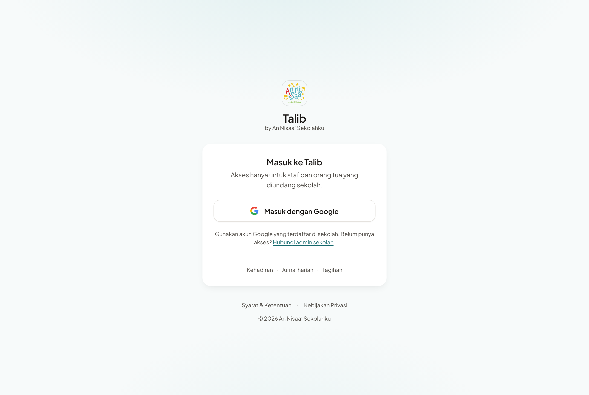
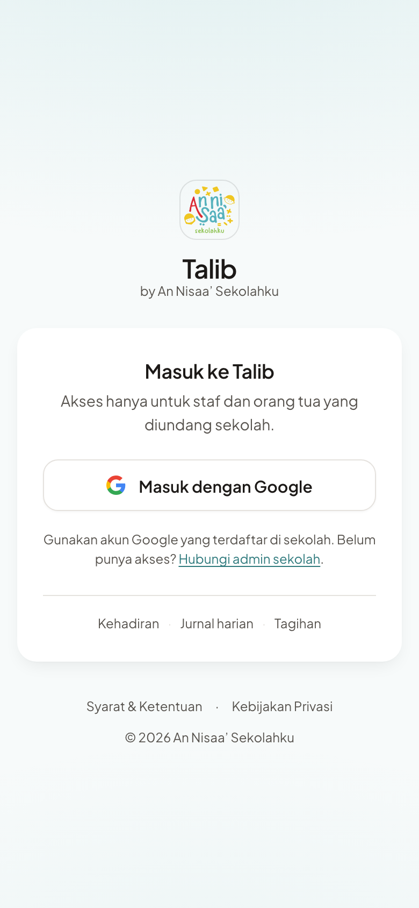
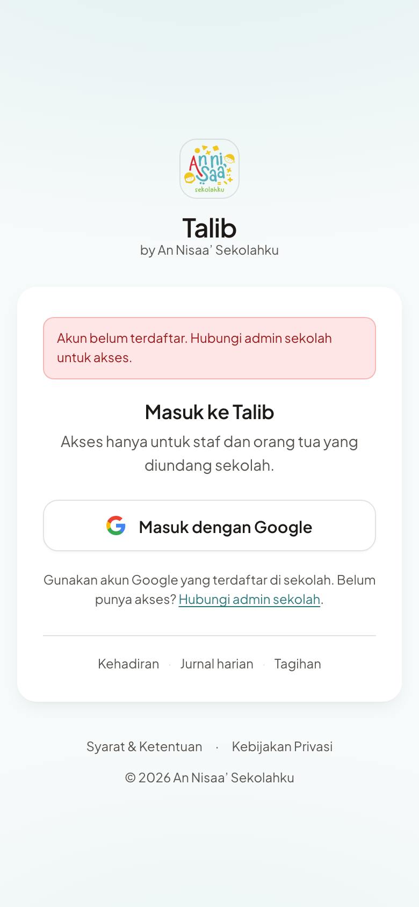
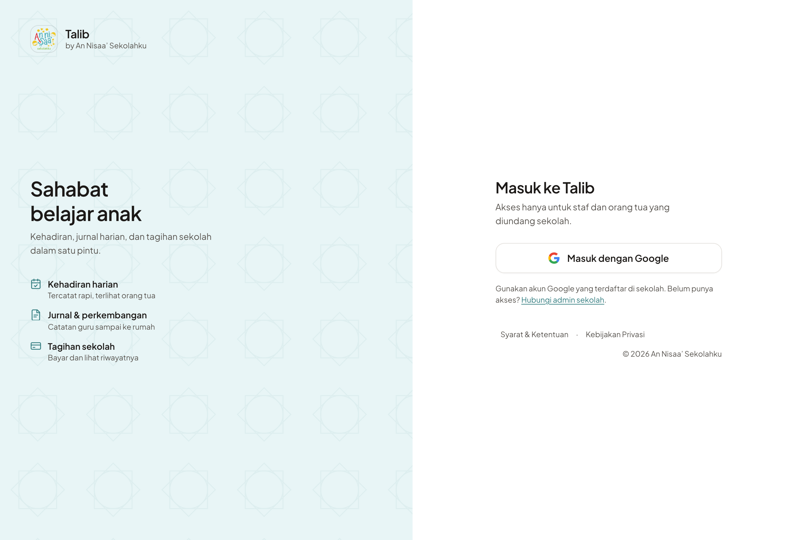
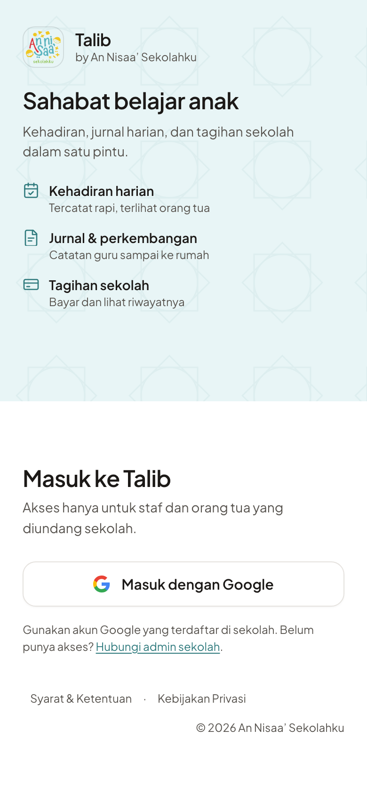

# Login redesign — proposal for owner review

> **Resolved 2026-08-12.** The owner picked a responsive variant of Direction B —
> desktop split, mobile with the Google button first — and accepted UI-only magic-link
> removal (the Supabase Email provider stays on). Implementation lives in
> [`docs/cycles/2026-08-12-login-redesign.md`](../../cycles/2026-08-12-login-redesign.md);
> the shipped screens are `login-desktop-1280.png` and `login-mobile-390.png` in this
> folder, captured by `scripts/capture-login.mjs`. Everything below is the original
> proposal, kept as the decision record.

Status: **proposal only**. No app code changed. Branch `feat/login-redesign` contains
this document, two static mockups, and the headless-render script that produced the
screenshots. Nothing here ships until the owner approves a direction.

Owner requirements:

1. Hide the magic-link sign-in option — Google only. Access is invitation-only.
2. Light background (current screen is dark — confirmed below).
3. Minimal, clean, compelling first impression.

---

## 1. Current-state audit

### Where it lives

| Thing | Location |
|---|---|
| Login screen | [`app/page.tsx`](../../../app/page.tsx) — the app root `/`, one client component, 312 lines |
| OAuth callback | [`app/auth/callback/route.ts`](../../../app/auth/callback/route.ts) |
| Brand wordmark | [`components/brand/talib-wordmark.tsx`](../../../components/brand/talib-wordmark.tsx) (`tone="onDark"` today) |
| Legal footer | [`components/layout/legal-footer.tsx`](../../../components/layout/legal-footer.tsx) (styled for a dark surface) |
| Login-only tokens | `--login-card-bg: #223838`, `--login-primary-hover: #4A9DA1` in [`app/globals.css:255`](../../../app/globals.css) |
| E2E coverage | [`e2e/branding.spec.ts:68`](../../../e2e/branding.spec.ts) — only spec that loads `/` |

### What it exposes today

`app/page.tsx` branches on `!!process.env.NEXT_PUBLIC_SUPABASE_URL`:

- **Supabase configured** (staging, preview, prod) — three paths:
  1. **Google OAuth** — `signInWithOAuth({ provider: "google" })`, `app/page.tsx:91`
  2. **Magic link** — email `<Input>` + `signInWithOtp()`, `app/page.tsx:70-88`, plus a
     "Cek Email Anda" confirmation state at `app/page.tsx:148-172`
  3. Error banner driven by `?error=` from the callback (`auth_failed`, `access_denied`)
- **Not configured** (local dev, all 33 Playwright specs) — **demo-mode account picker**
  that lists every `SCHOOL_ADMIN` + `TEACHER` from `/api/auth/users` and logs in via the
  `school-erp-session` cookie. This branch is unrelated to the redesign and must stay.

### Current styling — dark, confirmed

| Element | Current |
|---|---|
| Page background | `bg-sidebar` = `#1A2E2F` (deep teal, near-black) |
| Card | `bg-login-card-bg` = `#223838`, `border-white/5`, white text |
| Body copy | `text-sidebar-foreground` = `#8AACAD` |
| Google button | white pill on the dark card (`bg-white text-sidebar`) |
| Entrance motion | Framer Motion fade+rise, **not** wrapped in `prefers-reduced-motion` |

### How the auth methods are wired

Both Google and magic link land on the same `/auth/callback`, which:

1. Exchanges the code for a session.
2. Looks up `prisma.user.findFirst({ email, status: "ACTIVE" })` and routes to
   `/admin` / `/teacher` / `/parent` by role.
3. Falls back to an `Employee` then `Parent` email match (auto-provisioning).
4. Otherwise redirects to `/?error=access_denied`.

**The callback is method-agnostic.** It does not care whether the session came from
Google or from a magic link. That single fact drives the whole magic-link section below.

### Magic-link blast radius — it is exactly one call site

```
app/page.tsx:77   supabase.auth.signInWithOtp(...)
```

Verified by grep across `app/`, `lib/`, `components/`, `scripts/`, `e2e/`: no other
`signInWithOtp`, no `inviteUserByEmail`, no `generateLink`, no `resetPasswordForEmail`,
no `signInWithPassword`. There is **no admin or invite tooling that depends on magic
link.** Account provisioning goes through `auth.admin.createUser` with a service-role
key ([`scripts/reseed/users.ts:160`](../../../scripts/reseed/users.ts)), which is
independent of whether the Email provider accepts sign-ins.

---

## 2. Design thinking (better-interface, full mode)

Applied `better-accessibility`, `better-layout`, `better-writing`, `better-typography`,
`better-colors`, `better-ui`, with `.claude/standards/*` + `design-system.html` taking
precedence on brand, tokens, and Indonesian voice.

Findings that shape both directions — several are defects in the **current** screen:

| Severity | Domain | Location | Issue | Fix in the redesign |
|---|---|---|---|---|
| HIGH | Accessibility | `app/page.tsx:210-218` | Submit is disabled until the field is valid (`disabled={loading \|\| !email}`) — hides what to fix | Moot: the form is gone |
| HIGH | Accessibility | `app/page.tsx:176-186` | Primary action is `size="lg"` = **36px** tall (`h-9`), under the 44px touch minimum, on a phone-first product | 48px min-height |
| MEDIUM | Accessibility | `app/page.tsx:122-138` | Framer entrance is unconditional — no `prefers-reduced-motion` gate | Motion wrapped in `@media (prefers-reduced-motion: no-preference)` |
| MEDIUM | Colors | `components/ui/button.tsx:7` | Focus ring is `--ring` `#5DB4B8` — 2.36:1 on white, below the 3:1 non-text floor | Login uses `--primary-text` `#2F7A7D` (5.0:1 on white) for its focus ring |
| MEDIUM | Writing | `app/page.tsx:139-141` | Tagline is the only orientation; nothing states that access is invitation-only until you fail | Explicit "Akses hanya untuk staf dan orang tua yang diundang sekolah." above the action |
| MEDIUM | Writing | `app/page.tsx:305-307` | Dead-end when locked out — the error names no recovery route | "Belum punya akses? Hubungi admin sekolah." always visible, not only after failure |
| LOW | Layout | `app/page.tsx:188-192` | "atau" divider exists only to separate two methods | Removed with the second method — one action, no divider |
| LOW | UI | `app/page.tsx:136` | Logo has no outline; it sits on a dark field today, will sit on white next | `outline: 1px solid oklch(0 0 0 / 0.1)` per `better-ui` §8 |

Design decisions common to both directions:

- **One action, one emphasis.** A sign-in screen with a single control should look like
  it. No secondary buttons, no divider, no competing filled surfaces.
- **Google's light-button spec.** White surface + 1px neutral border + the four-colour
  mark. On a light page a white button needs the border to read as a control
  (`better-layout` §2).
- **Invitation framing before the failure, not after.** Stating the rule up front turns
  `access_denied` from a dead end into a confirmation.
- **Copy in sentence case, verb-first, existing terminology.** "Masuk dengan Google"
  is unchanged from today, so nothing in the glossary shifts.
- **Type + measure.** `--type-*` scale only; sub-copy capped at ~34ch with
  `text-wrap: pretty`, headline `balance`.
- **Concentric radius.** Card `--radius-2xl` (18px) → button `--radius-xl` (14px).

---

## 3. Two directions

Rendered headlessly with the mockup capture script, Chromium at 2x,
1280×860 and 390×844. Both passed the script's assertions: primary action 48px, no
horizontal overflow.

### Direction A — Quiet Card *(recommended)*

Centred card on the light `--background` `#F7FAFA` with a barely-there teal radial
wash. Logo + wordmark above the card, one Google button, invitation note, a three-word
capability strip, legal footer.





- Closest to a single-file rewrite of `app/page.tsx`; the demo branch stays untouched.
- Reads as a utility door, not a marketing page — right for a tool people open daily.
- Smallest surface for regressions; the layout is the one it already has.
- Cost: drops the tagline "Sahabat belajar anak" from the login screen, which
  `e2e/branding.spec.ts:71` asserts. Either keep the tagline under the wordmark or
  update that one assertion.

### Direction B — Split brand

Two columns above 62rem: a soft `--secondary` `#E8F5F6` brand panel carrying the
tagline, an 8-point Islamic geometric motif, and three capability rows; a white sign-in
column beside it. Stacks to brand-then-sign-in on mobile.




- More "compelling first impression" — the product explains itself before you sign in.
- Keeps the tagline, so `branding.spec.ts` passes unchanged.
- Cost: on a phone the brand panel pushes the primary action to roughly 620px down the
  page. For a screen staff hit twice a day that is a daily tax, and it is the reason A
  is the recommendation. Fixable by collapsing the panel to a two-line header under
  `62rem`, at the price of the mobile brand moment.
- Cost: ~2× the markup, one new motif asset, one new breakpoint to maintain.

**Recommendation: A.** B's brand panel earns its space on a marketing page; this screen
is opened by the same ~40 staff every morning. If the owner wants B's storytelling, the
cheap hybrid is A with the three capability rows expanded from the current one-line
strip.

---

## 4. How magic link gets hidden — and why UI-only is not enough

### The honest version

Deleting the form from `app/page.tsx` removes the **visible** path. It does not remove
the **actual** path. `NEXT_PUBLIC_SUPABASE_ANON_KEY` ships in the client bundle by
design, so anyone can still call Supabase's `/auth/v1/otp` endpoint directly. Because
`/auth/callback` is method-agnostic, a magic link delivered to an address that has an
`ACTIVE` User / Employee / Parent row still produces a **valid, fully-authorised
session**.

So UI-only removal buys appearance, not invitation-only access. It also leaves the
school's Supabase sender reachable as an email-spam surface for arbitrary addresses.

To be clear on what it is *not*: this is not an authorisation bypass. An address with no
matching row still lands on `/?error=access_denied` with no session.

### Recommended: two steps, in this order

**Step 1 — UI (this cycle, in the PR).** In `app/page.tsx`, delete `handleMagicLink`,
the `email` / `magicLinkSent` state, the `<form>`, the "Cek Email Anda" panel, and the
"atau" divider. Drop the now-unused `Mail`, `Field`, `FieldLabel`, `Input`, `Separator`
imports. Keep the `?error=` banner and the demo-mode branch exactly as they are.
Reversible by `git revert`.

**Step 2 — Provider (owner/CTO, Supabase dashboard, after Step 1 is live).** Disable
email sign-in for the Talib project so the endpoint stops honouring OTP requests:
Authentication → Providers → Email → off (or, on the newer dashboard, Email OTP /
magic link off while leaving admin operations alone). Do **staging first**, verify a
Google sign-in still works end to end, then prod.

Verified safe against this repo: nothing calls `signInWithOtp`, `signInWithPassword`,
`inviteUserByEmail`, or `generateLink`. `scripts/reseed/users.ts` provisions accounts
with the service-role `auth.admin.createUser`, which is unaffected by the provider
toggle. Seeded accounts get a random generated password nobody holds, so password
sign-in is not a live path either.

Not verified from the repo: the exact toggle name in the current Supabase dashboard,
and whether the school has ever used the dashboard's "Invite user" button (that flow
sends an email through the same provider). Both need a look at the live project before
Step 2.

### The one risk that can lock people out

**Anyone whose registered email is not a Google account cannot sign in after this
change.** Google OAuth needs a Google account; a `@yahoo.com` or ISP address that
worked via magic link stops working the moment the form disappears.

Pre-ship gate, run against **prod** in the Supabase SQL editor before merging:

```sql
select lower(split_part(email, '@', 2)) as domain, count(*) as n
from "Parent"
where email is not null and email <> ''
group by 1
order by n desc;
```

Repeat for `"User"` where `status = 'ACTIVE'` and for `"Employee"`. Every non-Gmail /
non-Workspace domain is a person who needs a Google-linked address before this ships.
I could not run this myself — there are no prod credentials in this environment, and
the staging DB is not a reliable proxy after the reseeds.

Second, smaller check: Supabase → Authentication → Logs, filtered to OTP sign-ins over
the last 30 days. Zero means nobody depends on the path today.

Mitigation if the check finds stragglers: they are unblocked by attaching a Google
address to their record, not by keeping the form. The `access_denied` copy already
points at the admin, and the redesign surfaces that recovery route before the failure
rather than after.

---

## 5. What changes where, if A is approved

| File | Change |
|---|---|
| `app/page.tsx` | Rewrite the Supabase branch: light shell, one Google action, invitation copy, reduced-motion gate. Demo branch untouched. |
| `components/layout/legal-footer.tsx` | Add a light-surface tone (today it is hardcoded for a dark background) |
| `components/brand/talib-wordmark.tsx` | Call with the default tone instead of `tone="onDark"` — no component change needed |
| `app/globals.css` | Retire `--login-card-bg` / `--login-primary-hover`; both are login-only and unused elsewhere |
| `e2e/branding.spec.ts:71` | Update the tagline assertion, or keep the tagline on the screen |
| `docs/cycles/<date>-login-redesign.md` | New cycle doc, created by `/spec` |
| `README.md` | Only if the route inventory changes — it does not |

Out of scope unless the owner asks: the demo-mode account picker, `/auth/callback`
logic, the legal pages, and any change to who has an account.

### Verification plan for the build cycle

- `npm run build && npx vitest run` between tasks
- `npx playwright test` end-of-cycle (the `/` specs live in `branding.spec.ts`)
- `/ship` preview-verify: real Google sign-in on the Vercel preview for admin, teacher,
  and parent, plus the `?error=access_denied` state
- Manual: 390px and 320px widths, keyboard-only sign-in, 200% zoom

---

## 6. Open questions for the owner

1. **Direction A or B** (or A plus B's capability rows)?
2. **Disable the Supabase Email provider** (Step 2), or hide the UI only and accept that
   magic link remains reachable for anyone who knows the endpoint?
3. Should "Hubungi admin sekolah" be a real link — `mailto:` or WhatsApp — and if so,
   to which address? Today it is plain text.
4. Does anyone currently sign in with a non-Google email address? The prod query above
   answers it; the answer decides whether this ships as-is or needs an account-migration
   step first.
